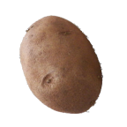

# Explosive Biter Optimizations

Performance patches for [Explosive Biters](https://mods.factorio.com/mod/Explosive_biters). Explosive aliens are fun until every death spawns fire, particles, and area damage across a sprawling base — this companion mod trims the expensive parts so you can keep the challenge without the UPS cliff.



## Why this mod exists

Explosive Biters adds worms, spitters, and biters that explode on death and spread fire. In large bases or long sessions, those effects add up: repeated explosion prototypes, lingering fire entities, and death-trigger scripts all cost CPU time every tick.

This mod applies targeted tweaks to Explosive Biters prototypes and runtime behavior so the mod remains dangerous, but cheaper to simulate.

## Requirements

- Factorio **2.0**
- [Explosive Biters](https://mods.factorio.com/mod/Explosive_biters) (hard dependency)

## Installation

1. Download or clone this repository into your Factorio mods folder:
   - **Linux:** `~/.factorio/mods/`
   - **Windows:** `%appdata%/Factorio/mods/`
   - **macOS:** `~/Library/Application Support/factorio/mods/`
2. Ensure the folder is named `explosive-biter-optimizations` (or `explosive-biter-optimizations_0.1.0` if zipped).
3. Enable **Explosive Biters** and **Explosive Biter Optimizations** in the mod list. This mod must load after Explosive Biters.

## Configuration

Startup settings (when implemented):

| Setting | Default | Description |
| --- | --- | --- |
| Optimization level | Balanced | Trade-off between visual fidelity and UPS savings |
| Reduce death explosions | On | Lighter explosion prototypes on biter/worm death |
| Reduce fire spread | On | Limits fire entities spawned by explosive units |
| Reduce particle effects | On | Fewer smoke and spark particles from explosions |

Settings will appear under **Settings → Startup** once the optimization passes are wired up.

## What gets optimized

Planned areas of work:

- **Death explosions** — smaller radius, fewer secondary effects, or simplified prototypes
- **Fire** — shorter lifetime, lower spread rate, or capped concurrent fires per area
- **Projectiles and spit** — reduced particle trails where safe
- **Runtime scripts** — avoid redundant work in control-stage handlers where Explosive Biters allows it

Gameplay balance is intentionally conservative: enemies should still feel explosive, just less visually and computationally noisy.

## Compatibility

- Built for Factorio **2.0** and **Explosive Biters 2.x**.
- Should coexist with optional Explosive Biters dependencies (`space-age`, `alien-biomes`, `Cold_biters`) when those mods are present.
- Does not replace Explosive Biters; it patches prototypes and behavior after the base mod loads.

## Development

This repository is the mod source. Factorio reads `info.json`, `data*.lua`, `control.lua`, and `settings.lua` from the repo root.

```text
explosive-biter-optimizations/
├── info.json
├── changelog.txt
├── thumbnail.png
├── settings.lua
├── data-final-fixes.lua   # prototype tweaks after Explosive Biters
├── control.lua            # runtime optimizations (if needed)
└── README.md              # also used as the basis for the mod portal description
```

To test locally, symlink or copy the repo into your mods directory and reload Factorio.

## License

TBD — add a license before publishing to the Factorio mod portal.
